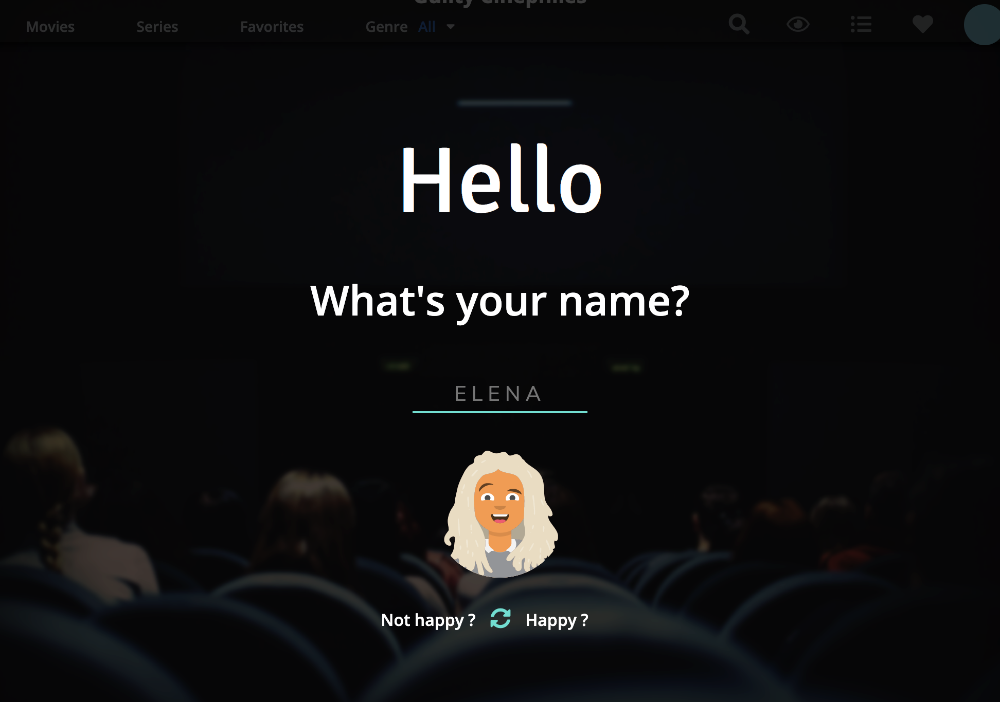
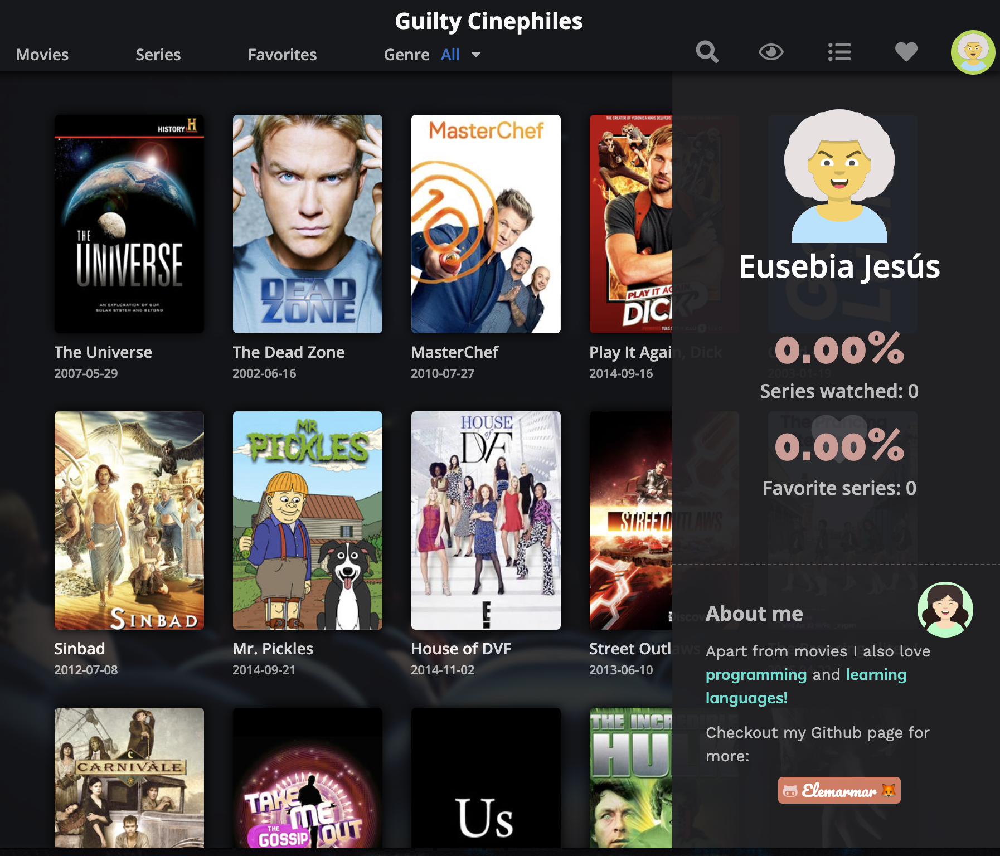
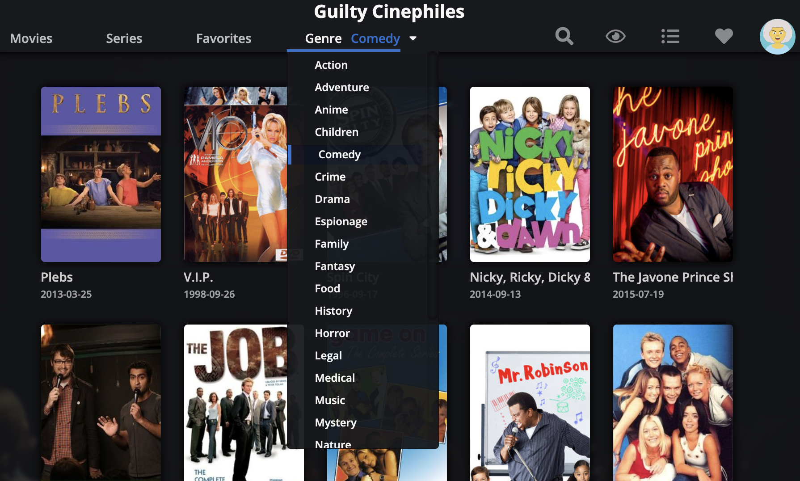
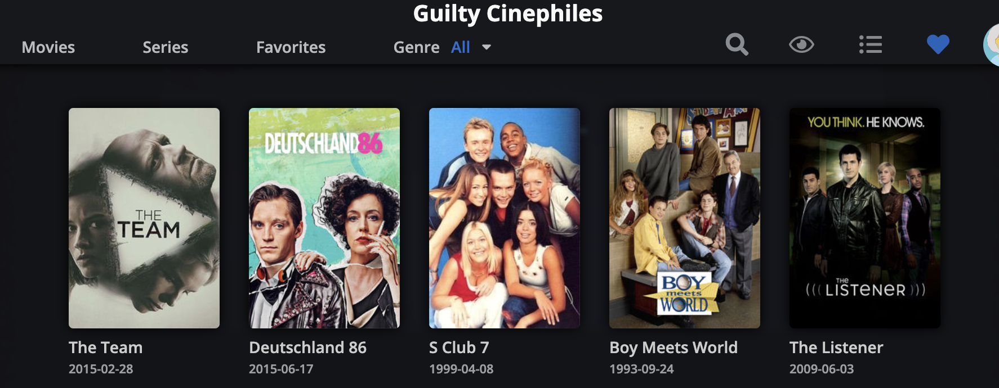
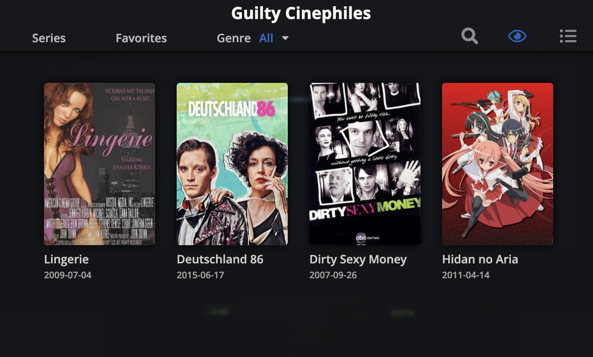
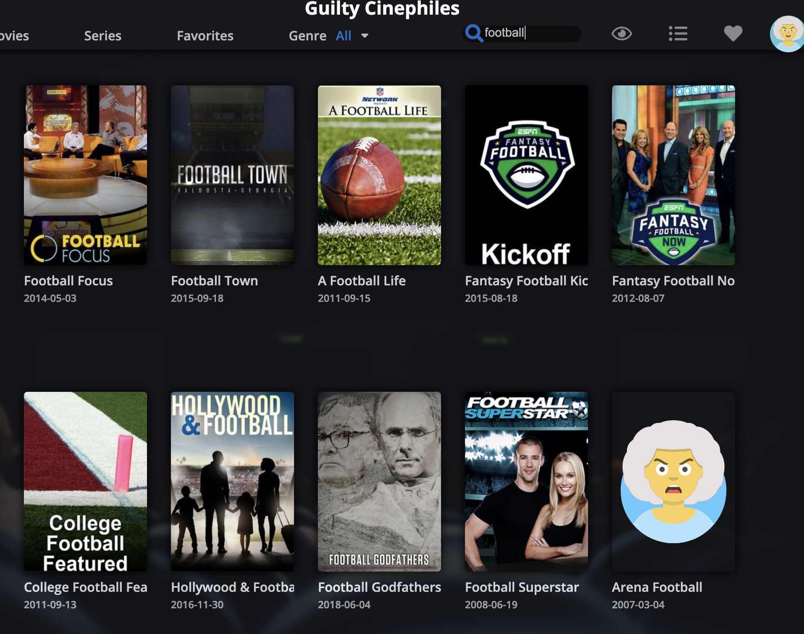

# Guilty Cinephiles 🍿 Series Finder

Esta aplicación web es una **web de búsqueda de series de TV** (*¡y de películas en el futuro!*) con la que el usuario puede buscar por título y explorar series según su género. Además, el usuario puede añadir series a una lista de **favoritas** y a otra de **vistas** (👉🏻 *en el futuro el usuario podrá crear sus propias listas*). Toda la información introducida por el usuario se guarda en el **localStorage** con lo que la información se mantiene en la página aunque cerremos el explorador. 

A continuación voy a explicar en más detalle:

1. Tecnologías empleadas
2. Cómo arrancar el proyecto
3. Servicios que ofrece la página
4. Menciones especiales

---

## Tecnologías empleadas

> En lugar de utilizar el **Adalab starter Kit** (que me parece maravilloso) decidí crear un servidor con **node.js** y **express** y crear una serie de tareas con **gulp**. Así aprendí el triple 🤓

### 1. Gulp y estructura de mi proyecto

Instalé gulp y creé tres tareas `style`,  `scripts` y `watch` para poder automatizar el flujo de mi trabajo. De esta manera los cambios del código se dan en la carpeta `src` pero gracias a gulp, automáticamente los archivos `js` y `scss` se concatenaban (y en el caso de `scss` se procesaban a `css`) y se guardan en un sólo fichero en la carpeta `public`.

```
/
|
|– public
|   |– api    // local apis
|   |– images    
|   |– js      
|   |– styles   
|
|– src
|   |– js
|   |– scss
|      |– components
|      |– core
|      |– layout
|      |– pages
|      |– main.scss
|
|– .gitignore
|
|– .gitignore
|
|– gulpfile.js
|
|– index.html 
|
|– package.json // project info + dependencies
|
|– server.js 

```

### 2. JavaScript

Para la parte de javascript he dividido los archivos por funcionalidad:

```
|– js
|   |– 01-welcome.js
|   |– 02-helpers.js  
|   |– 03-seres-page.js     
|   |– 04-favorites.js
|   |– 05-watched.js
|   |– 06-profile.js
|   |– 07-error.js
|   |– 08-ratings.js
```

Me he decantado en su mayoría por funciones tipo **arrow** para practicarlas, puesto que no las había utilizado mucho hasta ahora. La parte de JavaScript genera casi todo el contenido HTML de la página a excepción del menú de navegación del header, que viene ya en el archivo `index.html`. 

##### Trasteos con JavaScript

Como se puede ver en el proyecto he añadido cosas nuevas que no se pedían en un principio en el enunciado de la tarea. Algunas de estas tareas son:

- Pedir datos a otra API para generar avatares para los usuarios

- Pedir datos a un json en local para pintar citas de cine 

- Generar estadísticas del % de series vistas / en favoritas en la sección del perfil

- Pintar en la pantalla hasta 50 series aleatorias cuando iniciamos la página y cada vez que hacemos click en algún botón de filtrado o en "Series"

  > Para esto tuve que generar un array compuesto de números aleatorios que coincidieran con IDs de la api de TV Maze. Después, pintar dichos ids haciendo llamada a la api de TV Maze.

- Filtrar por género

  - 👉🏻 Esta tarea fue especialmente interesante puesto que la API que teníamos que utilizar, TV Maze, no permitía la búsqueda por género. Lo que hice fue hacer peticiones a la API por ID y guardar en un array un objeto con el **id** y los **genres** de cada peli que iba pidiendo al servidor. Una vez contaba con este array de objetos, lo pasé a `json` y luego pude utilizarlo como api local. La parte final consistió en pedir las series del archivo `json` con 'X' genero y posteriormente utilizar ese id para hacer las peticiones a la API de TC Maze 🎉.

    > Para esta parte se puede utilizar node, el paquete **fs** para generar un archivo `json` a partir de un objeto de javascript. 

### 3. Otras tecnologías:

- He utilizado **Sass** para crear los estilos de la página. Posteriormente, utilizando

- He manejado **Git** en todo momento para el control de versiones de mi proyecto. He creado una rama secundaria `dev` para experimentar

- Por lo demás, la página está escrita en HTML y CSS.

- He utilizado un poco **node** fundamentalmente para crear un archivo `server.js` desde el cual yo pudiera generar un servidor local con el que ver mi página. 

  > Para esto utilicé **express** y estas líneas:
  >
  > ```js
  > app.get('/', function (req, res) {
  >   res.sendFile(__dirname + '/index.html');
  > });
  > ```
  >
  > 👉🏻 Cuando el usuario acceda al explorador, el servidor le devuelva el archivo `index.html` de la carpeta raíz. 

  > Otra cosa interesante con **node** es que para poder acceder a los estilos y archivos de javascript tuve que incluir:
  >
  > ```js 
  > app.use(express.static('public'));
  > ```
  >
  > Para poder acceder a los archivos "estáticos" de la carpeta que llamé public. 

---

## Cómo arrancar el proyecto 🤷🏻‍♀️

#### A Modo guay:

Para poder arrancar la página, basta con descargarse una copia y, desde la terminal (¡y dentro de la carpeta raíz del proyecto!) escribir:

```bash
node server.js
```

> Para poder hacer esto necesitamos tener instalado en nuestro ordenador **node**

#### B Modo meh

Pues nada, una de estas:

- Pinchando en el `index.html` se debería de abrir el navegador con la página cargada
- Cliqueando [aqui](http://beta.adalab.es/modulo-2-evaluacion-final-elemarmar/) nos lleva a la aplicación, colgada en los servidores de Github

---

## Servicios que ofrece la página

### 1. Seguimiento del usuario

<p align="center">



</p>

Nada más entrar te pide tu nombre y que escojas un avatar de tu gusto. Una vez hecho esto, la información queda guardada en el localStorage para no preguntarte de nuevo. 

<p align="center">
  


</p>

Tras la pantalla de registro se nos muestra una pantalla de bienvenida en la que se saluda al usuario y se pinta una cita aleatoria de películas. Al pulsar en cualquier tecla, nos llevaría a la aplicación en sí. Esta pantalla de bienvenida nos aparece en los siguientes supuestos:

- Es la primera vez que nos metemos en la pagina y acabamos de meter nuestro usuario y contraseña
- Cada día diferente que nos metamos en la página (NO cuando refrescamos).

> Para poder hacer esto, cuando uno se "registra" se crea una nueva propiedad del objeto `user` que es `lastLogin` y que equivale a la fecha del momento en que se accede. Esto queda guardado y cada vez que se accede a la página se genera otra fecha de ese momento que se compara con el `lastLogin`, si son iguales, no se mostraría la pantalla de bienvenida, pero si son diferentes quiere decir que ese usuario no se metió en la página ese día y entonces se le mostraría la página de bienvenida. 
>
> 👉🏻 Issue con Mozilla: no funciona bien porque mozilla guarda en el localStorage también **la hora**. 

### Sección de perfil

<p align="center">



</p>

La página cuenta además con una sección de perfil al pulsar en la imagen del menú en la parte superior derecha. Esta sección abre un desplegable en el que se muestra el avatar del usuario, su nombre y estadísticas sobre el número de series que ha visto y el nº de series vistas.

> Para calcular este porcentaje he utilizado el número total de series de la api TV Maze... ¡49146! 😨 ¡Así que va a ser difícil para el usuario subir!

## 2. Explorador de series

<p align="center">




</p>

La página cuenta con un explorador de series en el que se muestran series aleatorias que coinciden con el filtrado aplicado. Si no hay filtrado, entonces aparecen series de todos los géneros. Como se aprecia en la imagen, si una serie no contara con imagen en la api de TV Maze, la imagen sería la del avatar del usuario pero enfadado 😡.

## 3. Listas de favoritos y vistas

<p align="center">


</p>

Al hacer hover sobre una carátula de serie se nos ofrece información sobre su rating y dependiendo del numero se nos muestran las estrellas. 

> Para hacer esto he creado un script que según la nota de la serie, se pinten unas u otras estrellas. 

En este modo también podemos seleccionar una película como **favorita** o **vista**, cambiando el aspecto de los iconos.

<p align="center">



</p>

Pinchando tanto en el corazón del menú como en la sección favoritos se nos mostrarían todas las películas que tenemos marcadas como favoritas. Desde ahí podemos quitarlas de favoritas pinchando en el corazón que aparece cuando hacemos hover en el poster. 

<p align="center">



</p>

La misma lógica se sigue con las películas vistas y cuando pulsamos el botón del ojo, que nos lleva a la sección de películas marcadas. como vistas. 

## 4. Búsqueda de series

<p align="center">



</p>

Si escribimos algo en el buscador, la página nos mía las series cuyo título coincida con nuestra búsqueda. 

---

## Menciones especiales

Para la realización de la página no he estado sola, he podido servirme del trabajo de otros, a disposición de todos. Aquí expongo mis fuentes de inspiración o recursos que he utilizado en la creación de este proyecto:

- [**TV Maze api**](https://www.tvmaze.com/api): utilizado para obtener información sobre series.
- **[Movie quotes de Lucas Vilaboim](https://github.com/vilaboim/movie-quotes/tree/e72e64502486d9d9d528277a1dbe94f20f011bc6)**: utilizado para pintar citas de cine en la página de bienvenida. 
- **[Avataaars Sprites](https://www.npmjs.com/package/@dicebear/avatars-avataaars-sprites)**: utilizado para generar los avatares de la página. 
- **[Popcorn Time](https://img.utdstc.com/screen/1/popcorn-time-009.jpg:300)**: como podéis ver no soy ninguna artista diseñadora 👩🏻‍🎨 y me he inspirado casi al milímetro en la aplicación popcorntime, que siempre me ha gustaod mucho su interfaz. He añadido algunos cambios y me gustaría añadir más en el futuro.

---

## License
[MIT](https://choosealicense.com/licenses/mit/)
